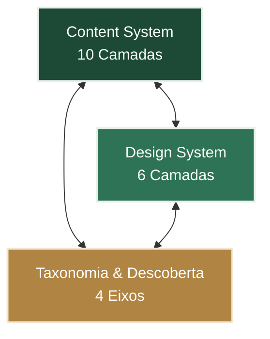

# 🏛️ Base de Conhecimento — CEFOR/Ifes

> **Plataforma institucional de formação em serviço e consulta rápida para profissionais de EaD do Ifes.**
> Redesign estrutural, arquitetura de informação content-first, Design System canônico e especificação técnica para WordPress.

---

<p align="center">
  <a href="https://wordpress.org">
    
  </a>
  <a href="#">
    
  </a>
  <a href="#">
    
  </a>
  <a href="#">
    
  </a>
</p>

---

## 🎯 Propósito-Farol

> *"A Base de Conhecimento do CEFOR é o lugar onde qualquer profissional de EaD do IFES resolve problemas com autonomia e se forma continuamente."*

O ecossistema é projetado para atuar em duas frentes simultâneas sobre a mesma interface:
* **Consulta Rápida:** "Estou com uma dúvida no Moodle agora e preciso da resposta exata em segundos."
* **Aprendizagem Contínua:** "Quero me atualizar sobre design educacional, acessibilidade e boas práticas de EaD."

---

## 🧠 Arquitetura: Os 3 Sistemas Interdependentes

A sustentação pedagógica e tecnológica da nova base apoia-se em três pilares fundamentais, descritos em detalhes nos documentos de saída:



* **[Content System (Como se escreve)](file:///c:/Users/elton/mmos/clientes/cefor/cefor-base-conhecimento/stages/01-fundacoes/output/contentsystem.md):** Governança editorial, voz e tom, padrões narrativos de escrita, rubrica de qualidade de 7 dimensões, padrões objetivos de legibilidade (Flesch PT-BR) e políticas de ciclo de vida/depreciação de conteúdo.
* **[Design System (Como se vê)](file:///c:/Users/elton/mmos/clientes/cefor/cefor-base-conhecimento/stages/02-design-system/output/design.md):** Tokens visuais (100% sans-serif, escala tipográfica escalável A-/A+, paleta clara/escura/alto contraste em OKLCH), sistema de leitura (~65-72ch) e catálogo normativo de componentes.
* **[Taxonomia & Descoberta (Como se navega)](file:///c:/Users/elton/mmos/clientes/cefor/cefor-base-conhecimento/stages/01-fundacoes/output/taxonomia.md):** Classificação robusta em 4 eixos (Tipo, Categoria, Tópicos Controlados, Trilha) abolindo tags livres, e modelo estrutural de agrupamentos (Trilha $\rightarrow$ Percurso).

---

## 📂 Mapa do Repositório (Folder Map)

```bash
cefor-base-conhecimento/
├── _config/                  # Diretrizes fundamentais do projeto
│   ├── projeto.md            # Identidade, premissas, público-alvo e plataforma
│   ├── pilares.md            # Mapeamento inicial dos 11 pilares do sistema
│   └── decisoes.md           # Registro canônico das 32 decisões formais aprovadas 📝
├── stages/                   # Pipeline do projeto dividido em fases funcionais
│   ├── 00-benchmarking/      # Fase 0 — Análise comparativa e pesquisa de mercado
│   ├── 01-fundacoes/         # Fase 1 — Especificações e output do Content System 🏗️
│   ├── 02-design-system/     # Fase 2 — Tokens, Style Guide e Prototipagem Visual 🎨
│   ├── 03-implementacao/     # Fase 3 — Custom Post Types, Blocos Gutenberg e Tema WP 💻
│   ├── 04-conteudo/          # Fase 4 — Triagem, reescrita de artigos e pilotos ✍️
│   └── 05-lancamento/        # Fase 5 — Beta test, redirecionamentos 301 e ContentOps 🚀
├── shared/                   # Recursos transversais e documentos de equipe
│   ├── roadmap.md            # Cronograma detalhado do pipeline e entregáveis 🗺️
│   └── reuniao-brainstorm.md # Memórias e ata do alinhamento inicial
└── data/                     # Dados brutos de inventário e termos legados
```

---

## 📊 Dashboard do Pipeline do Projeto

Acompanhe o progresso das entregas através de cada fase do pipeline:

| Fase | Título | Status | Principais Entregáveis Canônicos |
| :---: | :--- | :---: | :--- |
| **0** | **Benchmarking** |  | [Relatório Comparativo](file:///c:/Users/elton/mmos/clientes/cefor/cefor-base-conhecimento/stages/00-benchmarking/output/relatorio-comparativo.md) · Fichas de Análise (7 sites) · Inventário |
| **1** | **Fundações** |  | [Content System Mestre](file:///c:/Users/elton/mmos/clientes/cefor/cefor-base-conhecimento/stages/01-fundacoes/output/contentsystem.md) · [Taxonomia Oficial](file:///c:/Users/elton/mmos/clientes/cefor/cefor-base-conhecimento/stages/01-fundacoes/output/taxonomia.md) · [Padrões de Composição](file:///c:/Users/elton/mmos/clientes/cefor/cefor-base-conhecimento/stages/01-fundacoes/output/padroes-composicao.md) |
| **2** | **Design System** |  | [Design System Canônico (design.md)](file:///c:/Users/elton/mmos/clientes/cefor/cefor-base-conhecimento/stages/02-design-system/output/design.md) · [Visual Style Guide Vivo](file:///c:/Users/elton/mmos/clientes/cefor/cefor-base-conhecimento/stages/02-design-system/drafts/kit-visual.html) · [Prototipagem Base](#-referências-de-interface) |
| **3** | **Implementação** |  | Tema WordPress customizado · Custom Post Types (`artigo`, `trilha`, `percurso`) · Blocos customizados |
| **4** | **Conteúdo** |  | Triagem dos ~60 artigos da base antiga · Fluxo assistido por IA · Roteiro de Artigos-Piloto |
| **5** | **Lançamento** |  | Beta Fechado · Regras de Redirecionamento 301 · Painel Mensal de ContentOps |

---

## 🎨 Referências de Interface (Fase 2)

As decisões de layout e interações visuais estão materializadas nos **9 templates canônicos** de prototipagem em `stages/02-design-system/drafts/prototipos-paginas/` — um por tipo de página da arquitetura de informação. Todos compartilham a mesma casca (`shell.css/js` para header, breadcrumb e rodapé; `a11y.css/js` para o painel de acessibilidade).

**Páginas de item:**

* **[base-inicio.html](file:///c:/Users/elton/mmos/clientes/cefor/cefor-base-conhecimento/stages/02-design-system/drafts/prototipos-paginas/base-inicio.html):** Home/landing editorial — hero com busca protagonista, destaque de percursos e trilhas, amostra do catálogo.
* **[base-artigo.html](file:///c:/Users/elton/mmos/clientes/cefor/cefor-base-conhecimento/stages/02-design-system/drafts/prototipos-paginas/base-artigo.html):** Interface do artigo estruturada (título, subtítulo, bloco multimodal, sidebar sticky e rodapé ABNT) — referência canônica (Decisão 22).
* **[base-categoria.html](file:///c:/Users/elton/mmos/clientes/cefor/cefor-base-conhecimento/stages/02-design-system/drafts/prototipos-paginas/base-categoria.html):** Índice de categoria — hero claro com chip colorido, grid de artigos do domínio e filtros por tipo e tópico.
* **[base-trilha.html](file:///c:/Users/elton/mmos/clientes/cefor/cefor-base-conhecimento/stages/02-design-system/drafts/prototipos-paginas/base-trilha.html):** Página de trilha — hero verde-pálido, timeline sequencial de artigos e trilhas relacionadas.
* **[base-percurso.html](file:///c:/Users/elton/mmos/clientes/cefor/cefor-base-conhecimento/stages/02-design-system/drafts/prototipos-paginas/base-percurso.html):** Página de percurso — trilhas + artigos complementares, com a identidade cromática verde escura reservada ao percurso.
* **[base-topico.html](file:///c:/Users/elton/mmos/clientes/cefor/cefor-base-conhecimento/stages/02-design-system/drafts/prototipos-paginas/base-topico.html):** Descoberta por tópico — faixa neutra (tópico é transversal), artigos cross-categoria e trilhas relacionadas.

**Listagens e busca:**

* **[base-trilhas.html](file:///c:/Users/elton/mmos/clientes/cefor/cefor-base-conhecimento/stages/02-design-system/drafts/prototipos-paginas/base-trilhas.html):** Listagem de trilhas — grid único com filtro por categoria.
* **[base-percursos.html](file:///c:/Users/elton/mmos/clientes/cefor/cefor-base-conhecimento/stages/02-design-system/drafts/prototipos-paginas/base-percursos.html):** Listagem de percursos — 1 ativo (Dominando o Moodle) + candidatos da V2.
* **[base-busca.html](file:///c:/Users/elton/mmos/clientes/cefor/cefor-base-conhecimento/stages/02-design-system/drafts/prototipos-paginas/base-busca.html):** Busca unificada — artigos, trilhas e percursos numa lista, com filtro por tipo de conteúdo.

*Nota: Os arquivos anteriores de pesquisa visual foram catalogados de forma organizada no subdiretório [`historico/`](file:///c:/Users/elton/mmos/clientes/cefor/cefor-base-conhecimento/stages/02-design-system/drafts/prototipos-paginas/historico/).*

---

## 📝 Decisões Estratégicas (Consolidadas)

Para manter a governança robusta do projeto, as resoluções técnicas foram registradas na forma de um diário de bordo com **32 decisões documentadas**.
* 📂 Consulte o histórico completo em: **[_config/decisoes.md](file:///c:/Users/elton/mmos/clientes/cefor/cefor-base-conhecimento/_config/decisoes.md)**

```
Decisões 01-16: Propósito-Farol, Acessibilidade Básica, Escopo Negativo V1 (Fase 0).
Decisões 17-24: Arquitetura de 4 eixos, Ordem Multimodal, Política de Depreciação Interna (Fase 1).
Decisões 25-32: Definição estrutural de Trilhas/Percursos, Acordeão de Trilhas e Remoção de Ambiguidade no Rodapé.
```

---

## 🚀 Próximos Passos Imediatos

1. **Alinhamento do Refinamento de Trilhas:** Realizar validação formal das Decisões 25 a 32 (especificações de Trilha/Percurso V1) com a consultoria pedagógica (Rute) e a direção do CEFOR (Marquito).
2. **Triagem de Migração (Fase 4.1):** Mapear os ~60 artigos antigos nas categorias e tópicos controlados a partir da [Tabela de Triagem](file:///c:/Users/elton/mmos/clientes/cefor/cefor-base-conhecimento/stages/04-conteudo/output/triagem-artigos.md) aplicando a Rubrica de Qualidade.
3. **Draft Técnico do WordPress (Fase 3):** Traduzir os tokens e componentes definidos no `design.md` em configurações ativas no `theme.json` e desenvolver os Custom Post Types.

---

## 👥 Equipe do Projeto

| Nome | Função | Atribuição Técnica |
| :--- | :--- | :--- |
| **Elton Vinicius** | Tech Lead / Designer | Coordenação de design system, arquitetura tecnológica e desenvolvimento WP |
| **Marcos Forecchi (Marquito)** | Diretor do CEFOR / Dev | Apoio no desenvolvimento técnico e aprovação estrutural |
| **Juliana Cassaro** | Designer / Conteudista | Benchmarking, UX/UI, triagem e reescrita assistida de conteúdo |
| **Rutinelli Fávero (Rute)** | Consultora Pedagógica | Validação pedagógica, voz e tom e rubrica de qualidade de conteúdo |

---
*Projeto Institucional CEFOR/Ifes — Reformulação da Base de Conhecimento.*